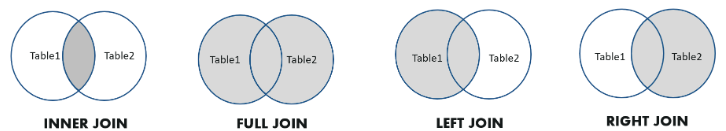
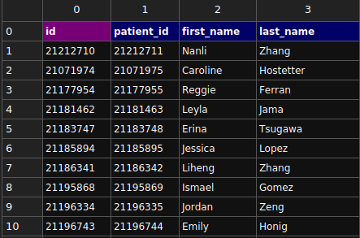

# Learning SQL

- [Learning SQL](#learning-sql)
  - [SQL constructs](#sql-constructs)
    - [Statements](#statements)
    - [Clauses](#clauses)
    - [Operators](#operators)
  - [Data Types](#data-types)
    - [Numeric](#numeric)
    - [Date and Time](#date-and-time)
    - [Character and String Data Types](#character-and-string-data-types)
    - [Unicode Character and String Data Types](#unicode-character-and-string-data-types)
    - [Binary Data Types](#binary-data-types)
    - [Miscellaneous Data Types](#miscellaneous-data-types)
  - [CREATE](#create)
    - [Create Database](#create-database)
    - [Create Tables](#create-tables)
  - [INSERT](#insert)
    - [Single record](#single-record)
    - [Multiple records](#multiple-records)
  - [SELECT](#select)
    - [Select all records from a table](#select-all-records-from-a-table)
    - [Select a specific column from a table](#select-a-specific-column-from-a-table)
    - [Select distinct data from a table](#select-distinct-data-from-a-table)
    - [Select within Range](#select-within-range)
  - [WHERE](#where)
    - [Select records where specific data is present](#select-records-where-specific-data-is-present)
    - [Select where records that contains](#select-where-records-that-contains)
  - [UPDATE](#update)
  - [DELETE](#delete)
  - [FUNCTIONS](#functions)
    - [COUNT](#count)
    - [MIN](#min)
    - [MAX](#max)
    - [AVG](#avg)
    - [SUM](#sum)
  - [LIKE](#like)
  - [WILDCARDS](#wildcards)
  - [IN](#in)
    - [BETWEEN](#between)
  - [ORDER BY](#order-by)
  - [ALTER TABLE](#alter-table)
    - [Renaming table](#renaming-table)
    - [Adding new columns](#adding-new-columns)
    - [Altering column](#altering-column)
    - [Dropping column](#dropping-column)
    - [Adding constraints](#adding-constraints)
    - [Dropping constraints](#dropping-constraints)
    - [Adding Foreign key and constraints](#adding-foreign-key-and-constraints)
  - [JOINS](#joins)
    - [INNER JOIN](#inner-join)
    - [LEFT JOIN](#left-join)
    - [RIGHT JOIN](#right-join)
    - [FULL JOIN](#full-join)
  - [ADVANCED JOINS](#advanced-joins)
    - [EQUI JOIN](#equi-join)
    - [NON EQUI JOIN](#non-equi-join)
    - [NATURAL JOIN](#natural-join)
    - [CROSS JOIN](#cross-join)
    - [SELF JOIN](#self-join)
  - [ALIASES](#aliases)
  - [VIEWS](#views)
    - [Creating PostgreSQL VIEWS](#creating-postgresql-views)
  - [SEQUENCES](#sequences)
    - [Complete syntax](#complete-syntax)
    - [Basic sequence](#basic-sequence)
    - [`nextval()` function](#nextval-function)
    - [Sequence examples](#sequence-examples)
      - [Creating simple sequence](#creating-simple-sequence)
      - [Creating Students table](#creating-students-table)
      - [Using sequence as students are inserted](#using-sequence-as-students-are-inserted)
      - [Creating sequence auto incremental](#creating-sequence-auto-incremental)
      - [Create pets table](#create-pets-table)
      - [Create sequence to auto increment id](#create-sequence-to-auto-increment-id)
  - [PROCEDURES](#procedures)
  - [TRIGGERS](#triggers)
    - [SQL Commands table](#sql-commands-table)
  - [Gists](#gists)
  - [References](#references)

## SQL constructs

### Statements

**DDL (Data Definition Language)**  

Used to define or modify database structures (e.g., tables, views, indexes).

| **Statement** | **Description**                                          |
| ------------- | -------------------------------------------------------- |
| `CREATE`      | Defines a new database object (e.g., table, view).       |
| `ALTER`       | Modifies an existing database object.                    |
| `DROP`        | Deletes a database object.                               |
| `TRUNCATE`    | Removes all rows from a table without logging deletions. |
| `RENAME`      | Renames a database object (e.g., table or column).       |

**DML (Data Manipulation Language)**  

Used for managing data within schema objects (tables, views).

| **Statement** | **Description**                         |
| ------------- | --------------------------------------- |
| `SELECT`      | Retrieves data from one or more tables. |
| `INSERT`      | Adds new data rows to a table.          |
| `UPDATE`      | Modifies existing data in a table.      |
| `DELETE`      | Removes data rows from a table.         |

**DCL (Data Control Language)**  

Used to control access to data and permissions in the database.

| **Statement** | **Description**                                  |
| ------------- | ------------------------------------------------ |
| `GRANT`       | Provides specific privileges to users or roles.  |
| `REVOKE`      | Removes specific privileges from users or roles. |

**TCL (Transaction Control Language)**  

Used to manage transactions and ensure data consistency.

| **Statement**           | **Description**                                          |
| ----------------------- | -------------------------------------------------------- |
| `COMMIT`                | Saves all changes made during the current transaction.   |
| `ROLLBACK`              | Undoes all changes made in the current transaction.      |
| `SAVEPOINT`             | Marks a point within a transaction to roll back to.      |
| `ROLLBACK TO SAVEPOINT` | Rolls back the transaction to a specific savepoint.      |
| `SET TRANSACTION`       | Configures transaction behavior (e.g., isolation level). |

---

### Clauses

| **Clause** | **Description**                                                     |
| ---------- | ------------------------------------------------------------------- |
| `WHERE`    | Filters rows based on a specified condition.                        |
| `ORDER BY` | Sorts the result set by one or more columns.                        |
| `GROUP BY` | Groups rows that share a property for aggregation.                  |
| `HAVING`   | Filters results after grouping, typically with aggregate functions. |
| `LIMIT`    | Limits the number of rows returned.                                 |
| `OFFSET`   | Skips a specified number of rows before starting to return rows.    |
| `JOIN`     | Combines rows from two or more tables based on a related column.    |
| `ON`       | Specifies the condition for the `JOIN`.                             |
| `IN`       | Filters rows based on a list of values.                             |
| `BETWEEN`  | Filters rows within a range of values.                              |
| `LIKE`     | Filters rows based on pattern matching.                             |
| `IS NULL`  | Filters rows where a column contains a `NULL` value.                |
| `DISTINCT` | Returns unique (non-duplicate) rows.                                |

### Operators

| **Operator**  | **Description**                                               |
| ------------- | ------------------------------------------------------------- |
| `=`           | Tests equality between two expressions.                       |
| `!=` / `<>`   | Tests inequality between two expressions.                     |
| `>`           | Greater than.                                                 |
| `<`           | Less than.                                                    |
| `>=`          | Greater than or equal to.                                     |
| `<=`          | Less than or equal to.                                        |
| `AND`         | Combines two or more conditions, all must be true.            |
| `OR`          | Combines two or more conditions, at least one must be true.   |
| `NOT`         | Negates a condition or expression.                            |
| `LIKE`        | Used for pattern matching in strings.                         |
| `IN`          | Tests if a value matches any value in a set or subquery.      |
| `BETWEEN`     | Tests if a value is within a specified range.                 |
| `IS NULL`     | Checks if a value is `NULL`.                                  |
| `IS NOT NULL` | Checks if a value is **not** `NULL`.                          |
| `EXISTS`      | Tests if a subquery returns any rows.                         |
| `ANY`         | Compares a value to any value in a set or subquery.           |
| `ALL`         | Compares a value to all values in a set or subquery.          |
| `CASE`        | Provides conditional logic in queries (like an IF statement). |

## Data Types

### Numeric

| Datatype | From                       | To                        |
| :------- | :------------------------- | :------------------------ |
| BIT      | 0                          | 1                         |
| TYNEINT  | 0                          | 255                       |
| SMALLINT | -32,768                    | 32,767                    |
| INT      | -2,147,483,648             | 2,147,483,647             |
| BIGINT   | -9,223,372,036,854,775,808 | 9,223,372,036,854,775,807 |
| DECIMAL  | -10^38 +1                  | 10^38 -1                  |
| NUMERIC  | -10^38 +1                  | 10^38 -1                  |
| FLOAT    | -1.79E + 308               | 1.79E + 308               |
| REAL     | -3.40E + 38                | 3.40E + 3 8               |

### Date and Time

| Datatype  | Description                                                                                                                 |
| :-------- | :-------------------------------------------------------------------------------------------------------------------------- |
| DATE      | Stores date in the format YYYY-MM-DD                                                                                        |
| TIME      | Stores time in the format HH:MI:SS                                                                                          |
| DATETIME  | Stores date and time information in the format YYYY-MM-DD HH:MI:SS                                                          |
| TIMESTAMP | Stores number of seconds passed since the Unix epoch (‘1970-01-01 00:00:00’ UTC)                                            |
| YEAR      | Stores year in 2 digits or 4 digit format. Range 1901 to 2155 in 4-digit format. Range 70 to 69, representing 1970 to 2069. |

### Character and String Data Types

| Datatype     | Description                                                                  |
| :----------- | :--------------------------------------------------------------------------- |
| CHAR         | Fixed length with a maximum length of 8,000 characters                       |
| VARCHAR      | Variable-length storage with a maximum length of 8,000 characters            |
| VARCHAR(max) | Variable-length storage with provided max characters, not supported in MySQL |
| TEXT         | Variable-length storage with maximum size of 2GB data                        |

### Unicode Character and String Data Types

| Datatype      | Description                                                       |
| :------------ | :---------------------------------------------------------------- |
| NCHAR         | Fixed length with maximum length of 4,000 characters              |
| NVARCHAR      | Variable-length storage with a maximum length of 4,000 characters |
| NVARCHAR(max) | Variable-length storage with provided max characters              |
| NTEXT         | Variable-length storage with a maximum size of 1GB data           |

> Note that above data types are not supported in MySQL database.

### Binary Data Types

| Datatype       | Description                                                  |
| :------------- | :----------------------------------------------------------- |
| BINARY         | Fixed length with a maximum length of 8,000 bytes            |
| VARBINARY      | Variable-length storage with a maximum length of 8,000 bytes |
| VARBINARY(max) | Variable-length storage with provided max bytes              |
| IMAGE          | Variable-length storage with maximum size of 2GB binary data |

### Miscellaneous Data Types

| Datatype | Description                                     |
| :------- | :---------------------------------------------- |
| CLOB     | Character large objects that can hold up to 2GB |
| BLOB     | For binary large objects                        |
| XML      | For storing XML data                            |
| JSON     | For storing JSON data                           |

## CREATE

### Create Database

```sql
CREATE DATABASE family;
```

### Create Tables

```sql
CREATE TABLE person (
    id SERIAL,
    first_name VARCHAR(35) NOT NULL,
    last_name VARCHAR(100) NOT NULL,
    birthday DATE NOT NULL
);
```

## INSERT

### Single record

```sql
INSERT INTO person (first_name, last_name, birthday)
VALUES ('Lucas', 'Barretto e Silva', '1986-08-05');
```

### Multiple records

```sql
INSERT INTO person (first_name, last_name, birthday)
VALUES
    ('Rafael', 'Barretto Casanova', '1982-08-10'),
    ('Daniel', 'Barretto e Silva', '1984-09-03'),
    ('Camila', 'Barretto Vieira', '1981-09-05');
```

## SELECT

### Select all records from a table

```sql
SELECT * FROM person
```

### Select a specific column from a table

```sql
SELECT column_name
FROM person;
```

### Select distinct data from a table

```sql
SELECT DISTINCT last_name FROM person
```

### Select within Range

```sql
SELECT MIN(birthday), MAX(birthday)
FROM person;
```

## WHERE

### Select records where specific data is present

```sql
SELECT * FROM person
WHERE last_name = "Barretto e Silva";
```

### Select where records that contains

```sql
SELECT * FROM person
WHERE last_name <> 'Barretto';
```

## UPDATE

```sql
UPDATE person
SET last_name = 'Barretto Vieira'
WHERE first_name = 'Camila';
```

## DELETE

```sql
DELETE FROM person
WHERE birthday < '1980-1-1';
```

## FUNCTIONS

### COUNT

```sql
SELECT COUNT(*) FROM person
```

### MIN

Find the lowest value from a column given a table:

```sql
SELECT MIN(column_name)
FROM table_name;

-- OR

SELECT MIN(column_name)
FROM table_name
WHERE condition;
```

### MAX

Find the highest value from a column given a table:

```sql
SELECT MAX(column_name)
FROM table_name;

-- OR
SELECT MAX(column_name)
FROM table_name
WHERE condition;
```

### AVG

Find the average price of all records given a table:

```sql
SELECT AVG(column_name)
FROM table_name;

-- OR
SELECT AVG(column_name)
FROM table_name
WHERE condition;
```

### SUM

```sql
SELECT SUM(column_name)
FROM table_name;

-- OR

SELECT SUM(column_name)
FROM table_name
WHERE condition;
```

## LIKE

On SQL we can also select values by approximation, matching values partially for that we use the `LIKE` operator>

```sql
SELECT column1, column2, ...
FROM table_name
WHERE columnN LIKE pattern;
```

**Example:**

```sql
SELECT *
FROM person
WHERE last_name LIKE '%Silva';
```

> For instance it will retrieve every record that includes on the last_name 'Silva', meaning 'Da Silva', 'e Silva', 'Silva'

## WILDCARDS

Wildcards are used in SQL to perform pattern matching, typically within the WHERE clause with the `LIKE` operator.

| **Wildcard** | **Description**                                           |
| ------------ | --------------------------------------------------------- |
| `%`          | Represents zero or more characters.                       |
| `_`          | Represents a single character.                            |
| `[ ]`        | Matches any single character within the brackets.         |
| `[^ ]`       | Matches any single character **not** within the brackets. |

**Examples:**

```sql
 -- Matches names starting with 'J'
 SELECT * 
 FROM users 
 WHERE name 
 LIKE 'J%'; 

 -- Matches 'John', 'Sean'
 SELECT * 
 FROM users 
 WHERE name 
 LIKE '_ohn'; 

 -- Matches 'John' or 'john'
 SELECT * 
 FROM users 
 WHERE name 
 LIKE '[Jj]ohn'; 

 -- Matches names not starting with 'J'
 SELECT * 
 FROM users 
 WHERE name 
 LIKE '[^J]ohn'; 
```

## IN

The `IN` operator allows you to specify multiple values in a `WHERE` clause.

```sql
SELECT column_name(s)
FROM table_name
WHERE column_name IN (value1, value2, ...);
```

**Example:**

```sql
SELECT * FROM Customers
WHERE Country IN ('Germany', 'France', 'UK');
```

### BETWEEN

The `BETWEEN` operator selects values within a given range. The values can be numbers, text, or dates.

The `BETWEEN` operator is inclusive: begin and end values are included.

```sql
SELECT column_name(s)
FROM table_name
WHERE column_name BETWEEN value1 AND value2;
```

**Example:**

```sql
SELECT * FROM Products
WHERE Price BETWEEN 10 AND 20;
```

**Example associated with IN:**

```sql
SELECT * FROM Products
WHERE Price BETWEEN 10 AND 20
AND CategoryID IN (1,2,3);
```

## ORDER BY

```sql
SELECT *
FROM person
ORDER BY first_name;
```

## ALTER TABLE

### Renaming table

```sql
ALTER TABLE person
RENAME TO child;
```

### Adding new columns

```sql
ALTER TABLE child
ADD COLUMN parent_id INT;
```

### Altering column

```sql
ALTER TABLE child
ALTER COLUMN parent_id SET DEFAULT 0;
```

### Dropping column

```sql
ALTER TABLE child
DROP COLUMN parent_id;
```

### Adding constraints

```sql
ALTER TABLE child
ADD CONSTRAINT unique_parent_id_constraint
UNIQUE (parent_id);
```

### Dropping constraints

```sql
ALTER TABLE child
DROP CONSTRAINT unique_parent_id_constraint;
```

### Adding Foreign key and constraints

```sql
ALTER TABLE child
ADD CONSTRAINT parent_id_constraint
FOREIGN KEY (parent_id)
REFERENCES parent (id);
```

## JOINS

| Join Type | Description                                                                                             |
| :-------- | :------------------------------------------------------------------------------------------------------ |
| INNER     | Only returns the values that has relation, skipping every record that has null relation                 |
| LEFT      | return the left table complete including null relations but removes null relations from the right table |
| RIGHT     | return the right table complete including null relations but removes null relations from the left table |
| FULL      | return every records from all joined table whether it has relation or not                               |



### INNER JOIN

```sql
SELECT child.first_name, child.last_name,
parent.first_name
FROM child
INNER JOIN parent
ON parent.id = child.parent_id;
```

### LEFT JOIN

```sql
SELECT child.first_name, child.last_name,
parent.first_name
FROM child
LEFT JOIN parent
ON parent.id = child.parent_id;
```

### RIGHT JOIN

```sql
SELECT child.first_name, child.last_name,
parent.first_name
FROM child
RIGHT JOIN parent
ON parent.id = child.parent_id;
```

### FULL JOIN

```sql
SELECT child.first_name, child.last_name,
parent.first_name
FROM child
FULL JOIN parent
ON parent.id = child.parent_id;
```

## ADVANCED JOINS

<https://www.w3resource.com/sql/joins/perform-an-equi-join.php>

### EQUI JOIN

### NON EQUI JOIN

### NATURAL JOIN

We have already learned that an EQUI JOIN performs a JOIN against equality or matching column(s) values of the associated tables and an equal sign (=) is used as comparison operator in the where clause to refer equality.

The SQL NATURAL JOIN is a type of EQUI JOIN and is structured in such a way that, columns with the same name of associated tables will appear once only.

> Basically a natural uses a common column to match and join results

### CROSS JOIN

### SELF JOIN

## ALIASES

SQL aliases are used to give a table, or a column in a table, a temporary name.

Aliases are often used to make column names more readable.

An alias only exists for the duration of that query.

An alias is created with the AS keyword.

```sql
SELECT CustomerID AS ID
FROM Customers;
```

**Using Aliases With a Space Character:**

```sql
SELECT ProductName AS [My Great Products]
FROM Products;
```

```sql
SELECT ProductName AS "My Great Products"
FROM Products;
```

**Using Alias and CONTACT:**

```sql
SELECT CustomerName, CONCAT(Address,', ',PostalCode,', ',City,', ',Country) AS Address
FROM Customers;
```

## VIEWS

A view is a pseudo-table it creates a table like data-structure that still responds to selects as tables, a view allow you to create set of data using different tables as main source.

### Creating PostgreSQL VIEWS

```sql
CREATE [OR REPLACE] VIEW view-name AS
  SELECT column(s)
  FROM table(s)
  [WHERE condition(s)];
```

> The OR REPLACE parameter will replace the view if it already exists. If omitted and the view already exists, an error will be returned.

**Example:**

```sql
CREATE OR REPLACE VIEW patients_and_person_data AS
SELECT persons.id,
  patients.id AS patient_id,
  persons.first_name,
  persons.last_name
  FROM persons
  JOIN patients ON patients.person_id = persons.id;
```



## SEQUENCES

A sequence in SQL is a user-defined schema-bound object that yields a sequence of integers based on a specified specification. The CREATE SEQUENCE statement is used to create sequences.

### Complete syntax

```sql
CREATE SEQUENCE sequence_name
  AS { SMALLINT | INT | BIGINT }
  INCREMENT BY { increment_by_value }
  MINVALUE { min_value } 
  MAXVALUE { max_value  }
  START WITH { start_value }
  CYCLE
  OWNED BY { table_name.column_name | NONE };
```

| Options  | Description                                                                                                                                                                           |
| :------- | :------------------------------------------------------------------------------------------------------------------------------------------------------------------------------------ |
| AS       | Specify the data type of the sequence                                                                                                                                                 |
| MINVALUE | The minimum value and maximum value of the sequence                                                                                                                                   |
| MAXVALUE | For an ascending sequence, the default maximum value is the maximum value of the data type of the sequence                                                                            |
| CYCLE    | The CYCLE allows you to restart the value if the limit is reached.                                                                                                                    |
| OWNED BY | The OWNED BY clause allows you to associate the table column with the sequence so that when you drop the column or table, PostgreSQL will automatically drop the associated sequence. |

### Basic sequence

```sql
CREATE SEQUENCE sequence_name
  INCREMENT BY { increment_by_value }
  START WITH { start_value };
```

### `nextval()` function

To get the next value from the sequence to you use the `nextval()` function:

```sql
SELECT nextval('sequence_name');
```

### Sequence examples

#### Creating simple sequence

```sql
CREATE SEQUENCE students_id_sequence
  START WITH 1
  INCREMENT BY 1
  MINVALUE 0
  MAXVALUE 40
```

#### Creating Students table

```sql
CREATE TABLE students (
  id NUMBER(10),
  name VARCHAR(20)
);
```

#### Using sequence as students are inserted

```sql
INSERT INTO students VALUES(students_id_sequence.nextval,'Ramesh');
INSERT INTO students VALUES(students_id_sequence.nextval,'Suresh');
);
```

Resulting:

| ID  |  NAME  |
| :-- | :----: |
| 1   | Ramesh |
| 2   | Suresh |

#### Creating sequence auto incremental

#### Create pets table

```sql
CREATE TABLE pets (
  id NUMBER(10),
  name VARCHAR(20)
)
```

#### Create sequence to auto increment id

```sql
CREATE SEQUENCE pets_id_sequence
  START WITH 1
  INCREMENT BY 1
  CACHE 1
  OWNED BY pets.id
```

```sql
ALTER TABLE ONLY pets ALTER COLUMN id SET DEFAULT nextval('pets.pets_id_sequence');
```

## PROCEDURES

## TRIGGERS

```sql
    CREATE FUNCTION emp_stamp() RETURNS trigger AS $emp_stamp$
    BEGIN
        -- Check that empname and salary are given
        IF NEW.empname IS NULL THEN
            RAISE EXCEPTION 'empname cannot be null';
        END IF;
        IF NEW.salary IS NULL THEN
            RAISE EXCEPTION '% cannot have null salary', NEW.empname;
        END IF;

        -- Who works for us when they must pay for it?
        IF NEW.salary < 0 THEN
            RAISE EXCEPTION '% cannot have a negative salary', NEW.empname;
        END IF;

        -- Remember who changed the payroll when
        NEW.last_date := current_timestamp;
        NEW.last_user := current_user;
        RETURN NEW;
    END;
$emp_stamp$ LANGUAGE plpgsql;"
```

### SQL Commands table

| Available help                   |
| :------------------------------- |
| ABORT                            |
| ALTER AGGREGATE                  |
| ALTER COLLATION                  |
| ALTER CONVERSION                 |
| ALTER DATABASE                   |
| ALTER DEFAULT PRIVILEGES         |
| ALTER DOMAIN                     |
| ALTER EVENT TRIGGER              |
| ALTER EXTENSION                  |
| ALTER FOREIGN DATA WRAPPER       |
| ALTER FOREIGN TABLE              |
| ALTER FUNCTION                   |
| ALTER GROUP                      |
| ALTER INDEX                      |
| ALTER LANGUAGE                   |
| ALTER LARGE OBJECT               |
| ALTER MATERIALIZED VIEW          |
| ALTER OPERATOR                   |
| ALTER OPERATOR CLASS             |
| ALTER OPERATOR FAMILY            |
| ALTER POLICY                     |
| ALTER PROCEDURE                  |
| ALTER PUBLICATION                |
| ALTER ROLE                       |
| ALTER ROUTINE                    |
| ALTER RULE                       |
| ALTER SCHEMA                     |
| ALTER SEQUENCE                   |
| ALTER SERVER                     |
| ALTER STATISTICS                 |
| ALTER SUBSCRIPTION               |
| PREPARE                          |
| PREPARE TRANSACTION              |
| REASSIGN OWNED                   |
| REFRESH MATERIALIZED VIEW        |
| REINDEX                          |
| RELEASE SAVEPOINT                |
| RESET                            |
| REVOKE                           |
| ROLLBACK                         |
| ROLLBACK PREPARED                |
| ROLLBACK TO SAVEPOINT            |
| SAVEPOINT                        |
| SECURITY LABEL                   |
| SELECT                           |
| SELECT INTO                      |
| SET                              |
| SET CONSTRAINTS                  |
| SET ROLE                         |
| SET SESSION AUTHORIZATION        |
| SET TRANSACTION                  |
| SHOW                             |
| START TRANSACTION                |
| TABLE                            |
| TRUNCATE                         |
| UNLISTEN                         |
| UPDATE                           |
| VACUUM                           |
| VALUES                           |
| WITH                             |
| ALTER SYSTEM                     |
| ALTER TABLE                      |
| ALTER TABLESPACE                 |
| ALTER TEXT SEARCH CONFIGURATION  |
| ALTER TEXT SEARCH DICTIONARY     |
| ALTER TEXT SEARCH PARSER         |
| ALTER TEXT SEARCH TEMPLATE       |
| ALTER TRIGGER                    |
| ALTER TYPE                       |
| ALTER USER                       |
| ALTER USER MAPPING               |
| ALTER VIEW                       |
| ANALYZE                          |
| BEGIN                            |
| CALL                             |
| CHECKPOINT                       |
| CLOSE                            |
| CLUSTER                          |
| COMMENT                          |
| COMMIT                           |
| COMMIT PREPARED                  |
| COPY                             |
| CREATE ACCESS METHOD             |
| CREATE AGGREGATE                 |
| CREATE CAST                      |
| CREATE COLLATION                 |
| CREATE CONVERSION                |
| CREATE DATABASE                  |
| CREATE DOMAIN                    |
| CREATE EVENT TRIGGER             |
| CREATE EXTENSION                 |
| CREATE FOREIGN DATA WRAPPER      |
| CREATE FOREIGN TABLE             |
| CREATE FUNCTION                  |
| CREATE GROUP                     |
| CREATE INDEX                     |
| CREATE LANGUAGE                  |
| CREATE MATERIALIZED VIEW         |
| CREATE OPERATOR                  |
| CREATE OPERATOR CLASS            |
| CREATE OPERATOR FAMILY           |
| CREATE POLICY                    |
| CREATE PROCEDURE                 |
| CREATE PUBLICATION               |
| CREATE ROLE                      |
| CREATE RULE                      |
| CREATE SCHEMA                    |
| CREATE SEQUENCE                  |
| CREATE SERVER                    |
| CREATE STATISTICS                |
| CREATE SUBSCRIPTION              |
| CREATE TABLE                     |
| CREATE TABLE AS                  |
| CREATE TABLESPACE                |
| CREATE TEXT SEARCH CONFIGURATION |
| CREATE TEXT SEARCH DICTIONARY    |
| CREATE TEXT SEARCH PARSER        |
| CREATE TEXT SEARCH TEMPLATE      |
| CREATE TRANSFORM                 |
| CREATE TRIGGER                   |
| CREATE TYPE                      |
| CREATE USER                      |
| CREATE USER MAPPING              |
| CREATE VIEW                      |
| DEALLOCATE                       |
| DECLARE                          |
| DELETE                           |
| DISCARD                          |
| DO                               |
| DROP ACCESS METHOD               |
| DROP AGGREGATE                   |
| DROP CAST                        |
| DROP COLLATION                   |
| DROP CONVERSION                  |
| DROP DATABASE                    |
| DROP DOMAIN                      |
| DROP EVENT TRIGGER               |
| DROP EXTENSION                   |
| DROP FOREIGN DATA WRAPPER        |
| DROP FOREIGN TABLE               |
| DROP FUNCTION                    |
| DROP GROUP                       |
| DROP INDEX                       |
| DROP LANGUAGE                    |
| DROP MATERIALIZED VIEW           |
| DROP OPERATOR                    |
| DROP OPERATOR CLASS              |
| DROP OPERATOR FAMILY             |
| DROP OWNED                       |
| DROP POLICY                      |
| DROP PROCEDURE                   |
| DROP PUBLICATION                 |
| DROP ROLE                        |
| DROP ROUTINE                     |
| DROP RULE                        |
| DROP SCHEMA                      |
| DROP SEQUENCE                    |
| DROP SERVER                      |
| DROP STATISTICS                  |
| DROP SUBSCRIPTION                |
| DROP TABLE                       |
| DROP TABLESPACE                  |
| DROP TEXT SEARCH CONFIGURATION   |
| DROP TEXT SEARCH DICTIONARY      |
| DROP TEXT SEARCH PARSER          |
| DROP TEXT SEARCH TEMPLATE        |
| DROP TRANSFORM                   |
| DROP TRIGGER                     |
| DROP TYPE                        |
| DROP USER                        |
| DROP USER MAPPING                |
| DROP VIEW                        |
| END                              |
| EXECUTE                          |
| EXPLAIN                          |
| FETCH                            |
| GRANT                            |
| IMPORT FOREIGN SCHEMA            |
| INSERT                           |
| LISTEN                           |
| LOAD                             |
| LOCK                             |
| MOVE                             |
| NOTIFY                           |

## Gists

[SQL Script to create test DB](https://gist.github.com/LucasBarretto86/ddeec416c707578c7d993238f2f46c14)

## References

[W3School SQL Tutorial](https://www.w3schools.com/sql/default.asp)
