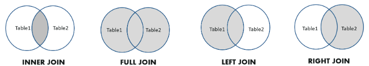
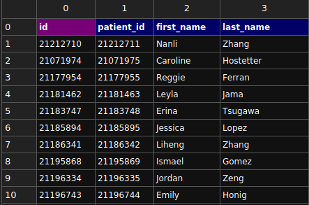

# Learning SQL

- [Learning SQL](#learning-sql)
  - [SQL constructs](#sql-constructs)
    - [Statements](#statements)
    - [Clauses](#clauses)
    - [Operators](#operators)
  - [SQL Data Types](#sql-data-types)
    - [Numeric](#numeric)
    - [Date and Time](#date-and-time)
    - [Character and String Data Types](#character-and-string-data-types)
    - [Unicode Character and String Data Types](#unicode-character-and-string-data-types)
    - [Binary Data Types](#binary-data-types)
    - [Miscellaneous Data Types](#miscellaneous-data-types)
  - [SQL Constraints](#sql-constraints)
    - [PRIMARY KEY](#primary-key)
    - [SQLite](#sqlite)
    - [MySQL](#mysql)
    - [PostgreSQL](#postgresql)
    - [SQL Server](#sql-server)
    - [Standard SQL (General Syntax)](#standard-sql-general-syntax)
    - [Key Points](#key-points)
  - [CREATE DATABASE](#create-database)
  - [CREATE TABLE](#create-table)
  - [INSERT](#insert)
    - [Single record](#single-record)
    - [Multiple records](#multiple-records)
  - [SELECT](#select)
    - [Select all records from a table](#select-all-records-from-a-table)
    - [Select a specific column from a table](#select-a-specific-column-from-a-table)
    - [Select distinct data from a table](#select-distinct-data-from-a-table)
    - [Select within Range](#select-within-range)
  - [WHERE](#where)
    - [Select records where specific data is present](#select-records-where-specific-data-is-present)
    - [Select where records that contains](#select-where-records-that-contains)
  - [UPDATE](#update)
  - [DELETE](#delete)
  - [FUNCTIONS](#functions)
    - [COUNT](#count)
    - [MIN](#min)
    - [MAX](#max)
    - [AVG](#avg)
    - [SUM](#sum)
  - [LIKE](#like)
  - [WILDCARDS](#wildcards)
  - [IN](#in)
    - [BETWEEN](#between)
  - [ORDER BY](#order-by)
  - [ALTER TABLE](#alter-table)
    - [Renaming table](#renaming-table)
    - [Adding new columns](#adding-new-columns)
    - [Altering column](#altering-column)
    - [Dropping column](#dropping-column)
    - [Adding constraints](#adding-constraints)
    - [Dropping constraints](#dropping-constraints)
    - [Adding Foreign key and constraints](#adding-foreign-key-and-constraints)
  - [JOINS](#joins)
    - [INNER JOIN](#inner-join)
    - [LEFT JOIN](#left-join)
    - [RIGHT JOIN](#right-join)
    - [FULL JOIN](#full-join)
  - [ADVANCED JOINS](#advanced-joins)
    - [EQUI JOIN](#equi-join)
    - [NON EQUI JOIN](#non-equi-join)
    - [NATURAL JOIN](#natural-join)
    - [CROSS JOIN](#cross-join)
    - [SELF JOIN](#self-join)
  - [ALIASES](#aliases)
  - [VIEWS](#views)
    - [Creating PostgreSQL VIEWS](#creating-postgresql-views)
  - [SEQUENCES](#sequences)
    - [Complete syntax](#complete-syntax)
    - [Basic sequence](#basic-sequence)
    - [`nextval()` function](#nextval-function)
    - [Sequence examples](#sequence-examples)
      - [Creating simple sequence](#creating-simple-sequence)
      - [Creating Students table](#creating-students-table)
      - [Using sequence as students are inserted](#using-sequence-as-students-are-inserted)
      - [Creating sequence auto incremental](#creating-sequence-auto-incremental)
      - [Create pets table](#create-pets-table)
      - [Create sequence to auto increment id](#create-sequence-to-auto-increment-id)
  - [PROCEDURES](#procedures)
  - [TRIGGERS](#triggers)
    - [SQL Commands table](#sql-commands-table)
  - [BACKUP DATABASE](#backup-database)
    - [WITH DIFFERENTIAL](#with-differential)
  - [Gists](#gists)
  - [References](#references)

## SQL constructs

### Statements

**DDL (Data Definition Language)**  

Used to define or modify database structures (e.g., tables, views, indexes).

| **Statement** | **Description**                                          |
| ------------- | -------------------------------------------------------- |
| `CREATE`      | Defines a new database object (e.g., table, view).       |
| `ALTER`       | Modifies an existing database object.                    |
| `DROP`        | Deletes a database object.                               |
| `TRUNCATE`    | Removes all rows from a table without logging deletions. |
| `RENAME`      | Renames a database object (e.g., table or column).       |

**DML (Data Manipulation Language)**  

Used for managing data within schema objects (tables, views).

| **Statement** | **Description**                         |
| ------------- | --------------------------------------- |
| `SELECT`      | Retrieves data from one or more tables. |
| `INSERT`      | Adds new data rows to a table.          |
| `UPDATE`      | Modifies existing data in a table.      |
| `DELETE`      | Removes data rows from a table.         |

**DCL (Data Control Language)**  

Used to control access to data and permissions in the database.

| **Statement** | **Description**                                  |
| ------------- | ------------------------------------------------ |
| `GRANT`       | Provides specific privileges to users or roles.  |
| `REVOKE`      | Removes specific privileges from users or roles. |

**TCL (Transaction Control Language)**  

Used to manage transactions and ensure data consistency.

| **Statement**           | **Description**                                          |
| ----------------------- | -------------------------------------------------------- |
| `COMMIT`                | Saves all changes made during the current transaction.   |
| `ROLLBACK`              | Undoes all changes made in the current transaction.      |
| `SAVEPOINT`             | Marks a point within a transaction to roll back to.      |
| `ROLLBACK TO SAVEPOINT` | Rolls back the transaction to a specific savepoint.      |
| `SET TRANSACTION`       | Configures transaction behavior (e.g., isolation level). |

---

### Clauses

| **Clause** | **Description**                                                     |
| ---------- | ------------------------------------------------------------------- |
| `WHERE`    | Filters rows based on a specified condition.                        |
| `ORDER BY` | Sorts the result set by one or more columns.                        |
| `GROUP BY` | Groups rows that share a property for aggregation.                  |
| `HAVING`   | Filters results after grouping, typically with aggregate functions. |
| `LIMIT`    | Limits the number of rows returned.                                 |
| `OFFSET`   | Skips a specified number of rows before starting to return rows.    |
| `JOIN`     | Combines rows from two or more tables based on a related column.    |
| `ON`       | Specifies the condition for the `JOIN`.                             |
| `IN`       | Filters rows based on a list of values.                             |
| `BETWEEN`  | Filters rows within a range of values.                              |
| `LIKE`     | Filters rows based on pattern matching.                             |
| `IS NULL`  | Filters rows where a column contains a `NULL` value.                |
| `DISTINCT` | Returns unique (non-duplicate) rows.                                |

### Operators

**Arithmetic Operators:**

| Operator | Description                                |
| -------- | ------------------------------------------ |
| `+`      | Adds two values.                           |
| `-`      | Subtracts the second value from the first. |
| `*`      | Multiplies two values.                     |
| `/`      | Divides the first value by the second.     |
| `%`      | Returns the remainder of a division.       |

---

**Comparison Operators:**

| Operator      | Description                                    |
| ------------- | ---------------------------------------------- |
| `=`           | Equal to.                                      |
| `!=`          | Not equal to (alternative: `<>`).              |
| `>`           | Greater than.                                  |
| `<`           | Less than.                                     |
| `>=`          | Greater than or equal to.                      |
| `<=`          | Less than or equal to.                         |
| `BETWEEN`     | Checks if a value is within a specified range. |
| `IN`          | Checks if a value is within a set of values.   |
| `LIKE`        | Matches a value against a pattern.             |
| `IS NULL`     | Checks if a value is `NULL`.                   |
| `IS NOT NULL` | Checks if a value is not `NULL`.               |

---

**Logical Operators:**

| Operator     | Description                                                       |
| ------------ | ----------------------------------------------------------------- |
| `AND`        | Returns `TRUE` if all conditions are `TRUE`.                      |
| `OR`         | Returns `TRUE` if any condition is `TRUE`.                        |
| `NOT`        | Negates a condition (returns `TRUE` if the condition is `FALSE`). |
| `ALL`        | Returns `TRUE` if all values in a subquery meet the condition.    |
| `ANY`/`SOME` | Returns `TRUE` if any value in a subquery meets the condition.    |
| `EXISTS`     | Returns `TRUE` if a subquery returns one or more rows.            |

---

**Bitwise Operators (if supported by the database):**

| Operator | Description          |
| -------- | -------------------- |
| `&`      | Bitwise AND.         |
| `|`      | Bitwise OR.          |
| `^`      | Bitwise XOR.         |
| `~`      | Bitwise NOT.         |
| `<<`     | Bitwise shift left.  |
| `>>`     | Bitwise shift right. |

---

**Others Operators:**

| Operator | Description                                        |
| -------- | -------------------------------------------------- |
| `||`     | Concatenates two strings (in most databases).      |
| `::`     | Casts a value to a specific type (PostgreSQL).     |
| `=`      | Assigns values in some contexts (e.g., variables). |

## SQL Data Types

### Numeric

| Datatype | From                       | To                        |
| :------- | :------------------------- | :------------------------ |
| BIT      | 0                          | 1                         |
| TYNEINT  | 0                          | 255                       |
| SMALLINT | -32,768                    | 32,767                    |
| INT      | -2,147,483,648             | 2,147,483,647             |
| BIGINT   | -9,223,372,036,854,775,808 | 9,223,372,036,854,775,807 |
| DECIMAL  | -10^38 +1                  | 10^38 -1                  |
| NUMERIC  | -10^38 +1                  | 10^38 -1                  |
| FLOAT    | -1.79E + 308               | 1.79E + 308               |
| REAL     | -3.40E + 38                | 3.40E + 3 8               |

### Date and Time

| Datatype  | Description                                                                                                                 |
| :-------- | :-------------------------------------------------------------------------------------------------------------------------- |
| DATE      | Stores date in the format YYYY-MM-DD                                                                                        |
| TIME      | Stores time in the format HH:MI:SS                                                                                          |
| DATETIME  | Stores date and time information in the format YYYY-MM-DD HH:MI:SS                                                          |
| TIMESTAMP | Stores number of seconds passed since the Unix epoch (‘1970-01-01 00:00:00’ UTC)                                            |
| YEAR      | Stores year in 2 digits or 4 digit format. Range 1901 to 2155 in 4-digit format. Range 70 to 69, representing 1970 to 2069. |

### Character and String Data Types

| Datatype     | Description                                                                  |
| :----------- | :--------------------------------------------------------------------------- |
| CHAR         | Fixed length with a maximum length of 8,000 characters                       |
| VARCHAR      | Variable-length storage with a maximum length of 8,000 characters            |
| VARCHAR(max) | Variable-length storage with provided max characters, not supported in MySQL |
| TEXT         | Variable-length storage with maximum size of 2GB data                        |

### Unicode Character and String Data Types

| Datatype      | Description                                                       |
| :------------ | :---------------------------------------------------------------- |
| NCHAR         | Fixed length with maximum length of 4,000 characters              |
| NVARCHAR      | Variable-length storage with a maximum length of 4,000 characters |
| NVARCHAR(max) | Variable-length storage with provided max characters              |
| NTEXT         | Variable-length storage with a maximum size of 1GB data           |

> Note that above data types are not supported in MySQL database.

### Binary Data Types

| Datatype       | Description                                                  |
| :------------- | :----------------------------------------------------------- |
| BINARY         | Fixed length with a maximum length of 8,000 bytes            |
| VARBINARY      | Variable-length storage with a maximum length of 8,000 bytes |
| VARBINARY(max) | Variable-length storage with provided max bytes              |
| IMAGE          | Variable-length storage with maximum size of 2GB binary data |

### Miscellaneous Data Types

| Datatype | Description                                     |
| :------- | :---------------------------------------------- |
| CLOB     | Character large objects that can hold up to 2GB |
| BLOB     | For binary large objects                        |
| XML      | For storing XML data                            |
| JSON     | For storing JSON data                           |

## SQL Constraints

Constraints in SQL are rules that are applied to columns in a table to enforce data integrity and ensure that the data follows certain criteria. They help maintain consistency and accuracy of the data within the database. Constraints are used to define the properties that the data in a table must adhere to.

Here’s the table with the constraints, and I've moved the SQL examples into a separate code block with comments explaining each constraint:

| **Constraint**     | **Description**                                                                                                |
| ------------------ | -------------------------------------------------------------------------------------------------------------- |
| **PRIMARY KEY**    | Uniquely identifies each row in a table. Ensures values are unique and non-null.                               |
| **FOREIGN KEY**    | Ensures the value in one table matches the value in another table (maintains referential integrity).           |
| **UNIQUE**         | Ensures all values in a column or a set of columns are unique.                                                 |
| **NOT NULL**       | Prevents a column from having NULL values.                                                                     |
| **CHECK**          | Ensures the values in a column satisfy a specific condition or range.                                          |
| **DEFAULT**        | Sets a default value for a column if no value is provided during insertion.                                    |
| **AUTO_INCREMENT** | Automatically increments a column value with each new row (PostgreSQL uses SERIAL, MySQL uses AUTO_INCREMENT). |
| **INDEX**          | Optimizes queries by creating an index on one or more columns for faster retrieval.                            |
| **UNIQUE INDEX**   | Combines uniqueness and indexing by ensuring that the column values are unique and indexed.                    |

**Examples:**

```sql
-- PRIMARY KEY: Uniquely identifies each row in the table
CREATE TABLE person (
    id INT PRIMARY KEY,  -- Primary key constraint ensures 'id' is unique and not NULL
    first_name VARCHAR(35) NOT NULL,
    last_name VARCHAR(100) NOT NULL,
    birthday DATE NOT NULL
);

-- FOREIGN KEY: Links 'user_id' to 'id' in the 'users' table
CREATE TABLE orders (
    order_id INT PRIMARY KEY,
    user_id INT,
    FOREIGN KEY (user_id) REFERENCES users(id)  -- Ensures referential integrity between 'orders' and 'users'
);

-- UNIQUE: Ensures 'email' is unique in the 'users' table
CREATE TABLE users (
    id SERIAL PRIMARY KEY,
    email VARCHAR(255) UNIQUE,  -- 'email' cannot have duplicate values
    username VARCHAR(50) NOT NULL
);

-- NOT NULL: Ensures 'first_name' cannot have a NULL value
CREATE TABLE customers (
    id INT PRIMARY KEY,
    first_name VARCHAR(50) NOT NULL,  -- 'first_name' must have a value
    last_name VARCHAR(50) NOT NULL
);

-- CHECK: Ensures 'age' is at least 18
CREATE TABLE people (
    id INT PRIMARY KEY,
    age INT CHECK (age >= 18)  -- 'age' must be 18 or older
);

-- DEFAULT: Sets default value for 'status' if not provided
CREATE TABLE users (
    id SERIAL PRIMARY KEY,
    status VARCHAR(20) DEFAULT 'active'  -- 'status' will be 'active' unless specified otherwise
);

-- AUTO_INCREMENT (PostgreSQL uses SERIAL, MySQL uses AUTO_INCREMENT): Automatically increments 'id' for each new row
CREATE TABLE employees (
    id SERIAL PRIMARY KEY,  -- 'id' will automatically increment with each insert (PostgreSQL)
    name VARCHAR(50)
);

-- INDEX: Creates an index on 'last_name' for faster queries
CREATE INDEX idx_last_name ON employees(last_name);  -- Improves search speed on 'last_name'

-- UNIQUE INDEX: Ensures 'email' is unique and also indexes it
CREATE UNIQUE INDEX idx_email ON users(email);  -- 'email' must be unique and indexed for faster access
```

This should now meet your request by clearly separating the SQL commands from the table.

### PRIMARY KEY

To create a primary key with `AUTOINCREMENT` in SQL, the syntax can vary slightly depending on the database system you are using. Here's how it's commonly done:

### SQLite

In SQLite, the `INTEGER PRIMARY KEY` automatically behaves as an autoincrementing column:

```sql
CREATE TABLE users (
    id INTEGER PRIMARY KEY AUTOINCREMENT,
    name TEXT,
    age INTEGER
);
```

### MySQL

In MySQL, you explicitly use the `AUTO_INCREMENT` keyword:

```sql
CREATE TABLE users (
    id INT AUTO_INCREMENT PRIMARY KEY,
    name VARCHAR(255),
    age INT
);
```

### PostgreSQL

In PostgreSQL, you can use the `SERIAL` pseudo-type to create an auto-incrementing primary key:

```sql
CREATE TABLE users (
    id SERIAL PRIMARY KEY,
    name TEXT,
    age INTEGER
);
```

Alternatively, starting with PostgreSQL 10+, you can use `GENERATED AS IDENTITY`:

```sql
CREATE TABLE users (
    id INT GENERATED ALWAYS AS IDENTITY PRIMARY KEY,
    name TEXT,
    age INTEGER
);
```

### SQL Server

In SQL Server, you use the `IDENTITY` keyword:

```sql
CREATE TABLE users (
    id INT IDENTITY(1,1) PRIMARY KEY,
    name NVARCHAR(255),
    age INT
);
```

### Standard SQL (General Syntax)

If your database system follows a more general SQL standard:

```sql
CREATE TABLE users (
    id INTEGER GENERATED ALWAYS AS IDENTITY PRIMARY KEY,
    name VARCHAR(255),
    age INTEGER
);
```

### Key Points

- **Primary Key**: Ensures each value in the column is unique and not null.
- **Autoincrement**: Automatically generates a unique value for each new row.

Make sure to check your specific database documentation for variations or additional options.

## CREATE DATABASE

```sql
CREATE DATABASE family;
```

## CREATE TABLE

```sql
CREATE TABLE person (
    first_name VARCHAR(35) NOT NULL,
    last_name VARCHAR(100) NOT NULL,
    birthday DATE NOT NULL
);
```

## INSERT

### Single record

```sql
INSERT INTO person (first_name, last_name, birthday)
VALUES ('Lucas', 'Barretto e Silva', '1986-08-05');
```

### Multiple records

```sql
INSERT INTO person (first_name, last_name, birthday)
VALUES
    ('Rafael', 'Barretto Casanova', '1982-08-10'),
    ('Daniel', 'Barretto e Silva', '1984-09-03'),
    ('Camila', 'Barretto Vieira', '1981-09-05');
```

## SELECT

### Select all records from a table

```sql
SELECT * FROM person
```

### Select a specific column from a table

```sql
SELECT column_name
FROM person;
```

### Select distinct data from a table

```sql
SELECT DISTINCT last_name FROM person
```

### Select within Range

```sql
SELECT MIN(birthday), MAX(birthday)
FROM person;
```

## WHERE

### Select records where specific data is present

```sql
SELECT * FROM person
WHERE last_name = "Barretto e Silva";
```

### Select where records that contains

```sql
SELECT * FROM person
WHERE last_name <> 'Barretto';
```

## UPDATE

```sql
UPDATE person
SET last_name = 'Barretto Vieira'
WHERE first_name = 'Camila';
```

## DELETE

```sql
DELETE FROM person
WHERE birthday < '1980-1-1';
```

## FUNCTIONS

### COUNT

```sql
SELECT COUNT(*) FROM person
```

### MIN

Find the lowest value from a column given a table:

```sql
SELECT MIN(column_name)
FROM table_name;

-- OR

SELECT MIN(column_name)
FROM table_name
WHERE condition;
```

### MAX

Find the highest value from a column given a table:

```sql
SELECT MAX(column_name)
FROM table_name;

-- OR
SELECT MAX(column_name)
FROM table_name
WHERE condition;
```

### AVG

Find the average price of all records given a table:

```sql
SELECT AVG(column_name)
FROM table_name;

-- OR
SELECT AVG(column_name)
FROM table_name
WHERE condition;
```

### SUM

```sql
SELECT SUM(column_name)
FROM table_name;

-- OR

SELECT SUM(column_name)
FROM table_name
WHERE condition;
```

## LIKE

On SQL we can also select values by approximation, matching values partially for that we use the `LIKE` operator>

```sql
SELECT column1, column2, ...
FROM table_name
WHERE columnN LIKE pattern;
```

**Example:**

```sql
SELECT *
FROM person
WHERE last_name LIKE '%Silva';
```

> For instance it will retrieve every record that includes on the last_name 'Silva', meaning 'Da Silva', 'e Silva', 'Silva'

## WILDCARDS

Wildcards are used in SQL to perform pattern matching, typically within the WHERE clause with the `LIKE` operator.

| **Wildcard** | **Description**                                           |
| ------------ | --------------------------------------------------------- |
| `%`          | Represents zero or more characters.                       |
| `_`          | Represents a single character.                            |
| `[ ]`        | Matches any single character within the brackets.         |
| `[^ ]`       | Matches any single character **not** within the brackets. |

**Examples:**

```sql
 -- Matches names starting with 'J'
 SELECT * 
 FROM users 
 WHERE name 
 LIKE 'J%'; 

 -- Matches 'John', 'Sean'
 SELECT * 
 FROM users 
 WHERE name 
 LIKE '_ohn'; 

 -- Matches 'John' or 'john'
 SELECT * 
 FROM users 
 WHERE name 
 LIKE '[Jj]ohn'; 

 -- Matches names not starting with 'J'
 SELECT * 
 FROM users 
 WHERE name 
 LIKE '[^J]ohn'; 
```

## IN

The `IN` operator allows you to specify multiple values in a `WHERE` clause.

```sql
SELECT column_name(s)
FROM table_name
WHERE column_name IN (value1, value2, ...);
```

**Example:**

```sql
SELECT * FROM Customers
WHERE Country IN ('Germany', 'France', 'UK');
```

### BETWEEN

The `BETWEEN` operator selects values within a given range. The values can be numbers, text, or dates.

The `BETWEEN` operator is inclusive: begin and end values are included.

```sql
SELECT column_name(s)
FROM table_name
WHERE column_name BETWEEN value1 AND value2;
```

**Example:**

```sql
SELECT * FROM Products
WHERE Price BETWEEN 10 AND 20;
```

**Example associated with IN:**

```sql
SELECT * FROM Products
WHERE Price BETWEEN 10 AND 20
AND CategoryID IN (1,2,3);
```

## ORDER BY

```sql
SELECT *
FROM person
ORDER BY first_name;
```

## ALTER TABLE

### Renaming table

```sql
ALTER TABLE person
RENAME TO child;
```

### Adding new columns

```sql
ALTER TABLE child
ADD COLUMN parent_id INT;
```

### Altering column

```sql
ALTER TABLE child
ALTER COLUMN parent_id SET DEFAULT 0;
```

### Dropping column

```sql
ALTER TABLE child
DROP COLUMN parent_id;
```

### Adding constraints

```sql
ALTER TABLE child
ADD CONSTRAINT unique_parent_id_constraint
UNIQUE (parent_id);
```

### Dropping constraints

```sql
ALTER TABLE child
DROP CONSTRAINT unique_parent_id_constraint;
```

### Adding Foreign key and constraints

```sql
ALTER TABLE child
ADD CONSTRAINT parent_id_constraint
FOREIGN KEY (parent_id)
REFERENCES parent (id);
```

## JOINS

| Join Type | Description                                                                                             |
| :-------- | :------------------------------------------------------------------------------------------------------ |
| INNER     | Only returns the values that has relation, skipping every record that has null relation                 |
| LEFT      | return the left table complete including null relations but removes null relations from the right table |
| RIGHT     | return the right table complete including null relations but removes null relations from the left table |
| FULL      | return every records from all joined table whether it has relation or not                               |



### INNER JOIN

```sql
SELECT child.first_name, child.last_name,
parent.first_name
FROM child
INNER JOIN parent
ON parent.id = child.parent_id;
```

### LEFT JOIN

```sql
SELECT child.first_name, child.last_name,
parent.first_name
FROM child
LEFT JOIN parent
ON parent.id = child.parent_id;
```

### RIGHT JOIN

```sql
SELECT child.first_name, child.last_name,
parent.first_name
FROM child
RIGHT JOIN parent
ON parent.id = child.parent_id;
```

### FULL JOIN

```sql
SELECT child.first_name, child.last_name,
parent.first_name
FROM child
FULL JOIN parent
ON parent.id = child.parent_id;
```

## ADVANCED JOINS

<https://www.w3resource.com/sql/joins/perform-an-equi-join.php>

### EQUI JOIN

### NON EQUI JOIN

### NATURAL JOIN

We have already learned that an EQUI JOIN performs a JOIN against equality or matching column(s) values of the associated tables and an equal sign (=) is used as comparison operator in the where clause to refer equality.

The SQL NATURAL JOIN is a type of EQUI JOIN and is structured in such a way that, columns with the same name of associated tables will appear once only.

> Basically a natural uses a common column to match and join results

### CROSS JOIN

### SELF JOIN

## ALIASES

SQL aliases are used to give a table, or a column in a table, a temporary name.

Aliases are often used to make column names more readable.

An alias only exists for the duration of that query.

An alias is created with the AS keyword.

```sql
SELECT CustomerID AS ID
FROM Customers;
```

**Using Aliases With a Space Character:**

```sql
SELECT ProductName AS [My Great Products]
FROM Products;
```

```sql
SELECT ProductName AS "My Great Products"
FROM Products;
```

**Using Alias and CONTACT:**

```sql
SELECT CustomerName, CONCAT(Address,', ',PostalCode,', ',City,', ',Country) AS Address
FROM Customers;
```

## VIEWS

A view is a pseudo-table it creates a table like data-structure that still responds to selects as tables, a view allow you to create set of data using different tables as main source.

### Creating PostgreSQL VIEWS

```sql
CREATE [OR REPLACE] VIEW view-name AS
  SELECT column(s)
  FROM table(s)
  [WHERE condition(s)];
```

> The OR REPLACE parameter will replace the view if it already exists. If omitted and the view already exists, an error will be returned.

**Example:**

```sql
CREATE OR REPLACE VIEW patients_and_person_data AS
SELECT persons.id,
  patients.id AS patient_id,
  persons.first_name,
  persons.last_name
  FROM persons
  JOIN patients ON patients.person_id = persons.id;
```



## SEQUENCES

A sequence in SQL is a user-defined schema-bound object that yields a sequence of integers based on a specified specification. The CREATE SEQUENCE statement is used to create sequences.

### Complete syntax

```sql
CREATE SEQUENCE sequence_name
  AS { SMALLINT | INT | BIGINT }
  INCREMENT BY { increment_by_value }
  MINVALUE { min_value } 
  MAXVALUE { max_value  }
  START WITH { start_value }
  CYCLE
  OWNED BY { table_name.column_name | NONE };
```

| Options  | Description                                                                                                                                                                           |
| :------- | :------------------------------------------------------------------------------------------------------------------------------------------------------------------------------------ |
| AS       | Specify the data type of the sequence                                                                                                                                                 |
| MINVALUE | The minimum value and maximum value of the sequence                                                                                                                                   |
| MAXVALUE | For an ascending sequence, the default maximum value is the maximum value of the data type of the sequence                                                                            |
| CYCLE    | The CYCLE allows you to restart the value if the limit is reached.                                                                                                                    |
| OWNED BY | The OWNED BY clause allows you to associate the table column with the sequence so that when you drop the column or table, PostgreSQL will automatically drop the associated sequence. |

### Basic sequence

```sql
CREATE SEQUENCE sequence_name
  INCREMENT BY { increment_by_value }
  START WITH { start_value };
```

### `nextval()` function

To get the next value from the sequence to you use the `nextval()` function:

```sql
SELECT nextval('sequence_name');
```

### Sequence examples

#### Creating simple sequence

```sql
CREATE SEQUENCE students_id_sequence
  START WITH 1
  INCREMENT BY 1
  MINVALUE 0
  MAXVALUE 40
```

#### Creating Students table

```sql
CREATE TABLE students (
  id NUMBER(10),
  name VARCHAR(20)
);
```

#### Using sequence as students are inserted

```sql
INSERT INTO students VALUES(students_id_sequence.nextval,'Ramesh');
INSERT INTO students VALUES(students_id_sequence.nextval,'Suresh');
);
```

Resulting:

| ID  |  NAME  |
| :-- | :----: |
| 1   | Ramesh |
| 2   | Suresh |

#### Creating sequence auto incremental

#### Create pets table

```sql
CREATE TABLE pets (
  id NUMBER(10),
  name VARCHAR(20)
)
```

#### Create sequence to auto increment id

```sql
CREATE SEQUENCE pets_id_sequence
  START WITH 1
  INCREMENT BY 1
  CACHE 1
  OWNED BY pets.id
```

```sql
ALTER TABLE ONLY pets ALTER COLUMN id SET DEFAULT nextval('pets.pets_id_sequence');
```

## PROCEDURES

## TRIGGERS

```sql
    CREATE FUNCTION emp_stamp() RETURNS trigger AS $emp_stamp$
    BEGIN
        -- Check that empname and salary are given
        IF NEW.empname IS NULL THEN
            RAISE EXCEPTION 'empname cannot be null';
        END IF;
        IF NEW.salary IS NULL THEN
            RAISE EXCEPTION '% cannot have null salary', NEW.empname;
        END IF;

        -- Who works for us when they must pay for it?
        IF NEW.salary < 0 THEN
            RAISE EXCEPTION '% cannot have a negative salary', NEW.empname;
        END IF;

        -- Remember who changed the payroll when
        NEW.last_date := current_timestamp;
        NEW.last_user := current_user;
        RETURN NEW;
    END;
$emp_stamp$ LANGUAGE plpgsql;"
```

### SQL Commands table

Here is a comprehensive table containing all SQL commands along with their descriptions, merged from both tables:

| **SQL Command**                      | **Description**                                                                                               |
| ------------------------------------ | ------------------------------------------------------------------------------------------------------------- |
| **ABORT**                            | Terminates the current transaction.                                                                           |
| **ADD**                              | Adds a column in an existing table.                                                                           |
| **ADD CONSTRAINT**                   | Adds a constraint after a table is already created.                                                           |
| **AGGREGATE**                        | Defines an aggregate function in SQL.                                                                         |
| **ALL**                              | Returns true if all of the subquery values meet the condition.                                                |
| **ALTER**                            | Adds, deletes, or modifies columns in a table, or changes the data type of a column.                          |
| **ALTER COLUMN**                     | Changes the data type of a column in a table.                                                                 |
| **ALTER TABLE**                      | Adds, deletes, or modifies columns in a table.                                                                |
| **ALTER AGGREGATE**                  | Modifies an aggregate function.                                                                               |
| **ALTER COLLATION**                  | Modifies a collation.                                                                                         |
| **ALTER CONVERSION**                 | Modifies a conversion.                                                                                        |
| **ALTER DATABASE**                   | Modifies a database.                                                                                          |
| **ALTER DEFAULT PRIVILEGES**         | Modifies the default privileges for new objects in a schema.                                                  |
| **ALTER DOMAIN**                     | Modifies a domain.                                                                                            |
| **ALTER EVENT TRIGGER**              | Modifies an event trigger.                                                                                    |
| **ALTER EXTENSION**                  | Modifies an extension.                                                                                        |
| **ALTER FOREIGN DATA WRAPPER**       | Modifies a foreign data wrapper.                                                                              |
| **ALTER FOREIGN TABLE**              | Modifies a foreign table.                                                                                     |
| **ALTER FUNCTION**                   | Modifies a function.                                                                                          |
| **ALTER GROUP**                      | Modifies a role group.                                                                                        |
| **ALTER INDEX**                      | Modifies an index.                                                                                            |
| **ALTER LANGUAGE**                   | Modifies a procedural language.                                                                               |
| **ALTER LARGE OBJECT**               | Modifies a large object.                                                                                      |
| **ALTER MATERIALIZED VIEW**          | Modifies a materialized view.                                                                                 |
| **ALTER OPERATOR**                   | Modifies an operator.                                                                                         |
| **ALTER OPERATOR CLASS**             | Modifies an operator class.                                                                                   |
| **ALTER OPERATOR FAMILY**            | Modifies an operator family.                                                                                  |
| **ALTER POLICY**                     | Modifies a policy.                                                                                            |
| **ALTER PROCEDURE**                  | Modifies a procedure.                                                                                         |
| **ALTER PUBLICATION**                | Modifies a publication.                                                                                       |
| **ALTER ROLE**                       | Modifies a role.                                                                                              |
| **ALTER ROUTINE**                    | Modifies a routine.                                                                                           |
| **ALTER RULE**                       | Modifies a rule.                                                                                              |
| **ALTER SCHEMA**                     | Modifies a schema.                                                                                            |
| **ALTER SEQUENCE**                   | Modifies a sequence.                                                                                          |
| **ALTER SERVER**                     | Modifies a server.                                                                                            |
| **ALTER STATISTICS**                 | Modifies statistics.                                                                                          |
| **ALTER SUBSCRIPTION**               | Modifies a subscription.                                                                                      |
| **ALTER SYSTEM**                     | Modifies system settings.                                                                                     |
| **ALTER TABLESPACE**                 | Modifies a tablespace.                                                                                        |
| **ALTER TEXT SEARCH CONFIGURATION**  | Modifies a text search configuration.                                                                         |
| **ALTER TRIGGER**                    | Modifies a trigger.                                                                                           |
| **ALTER TYPE**                       | Modifies a type.                                                                                              |
| **ALTER USER**                       | Modifies a user.                                                                                              |
| **ALTER USER MAPPING**               | Modifies a user mapping.                                                                                      |
| **ALTER VIEW**                       | Modifies a view.                                                                                              |
| **ANALYZE**                          | Collects statistics about database objects.                                                                   |
| **BACKUP DATABASE**                  | Creates a backup of an existing database.                                                                     |
| **BEGIN**                            | Starts a new transaction block.                                                                               |
| **BETWEEN**                          | Selects values within a given range.                                                                          |
| **CALL**                             | Executes a stored procedure.                                                                                  |
| **CASE**                             | Creates different outputs based on conditions.                                                                |
| **CHECK**                            | A constraint that limits the value that can be placed in a column.                                            |
| **CHECKPOINT**                       | Forces a write of all modified pages in memory to disk.                                                       |
| **CLOSE**                            | Closes a cursor.                                                                                              |
| **CLUSTER**                          | Reorders a table based on an index.                                                                           |
| **COMMENT**                          | Adds comments to a database object.                                                                           |
| **COMMIT**                           | Commits the current transaction.                                                                              |
| **COMMIT PREPARED**                  | Commits a previously prepared transaction.                                                                    |
| **CONSTRAINT**                       | Adds or deletes a constraint.                                                                                 |
| **CREATE**                           | Creates a database, index, view, table, or procedure.                                                         |
| **CREATE AGGREGATE**                 | Creates an aggregate function.                                                                                |
| **CREATE CAST**                      | Creates a cast function.                                                                                      |
| **CREATE COLLATION**                 | Creates a collation.                                                                                          |
| **CREATE CONVERSION**                | Creates a conversion.                                                                                         |
| **CREATE DATABASE**                  | Creates a new SQL database.                                                                                   |
| **CREATE DOMAIN**                    | Creates a domain.                                                                                             |
| **CREATE EVENT TRIGGER**             | Creates an event trigger.                                                                                     |
| **CREATE EXTENSION**                 | Creates an extension.                                                                                         |
| **CREATE FOREIGN DATA WRAPPER**      | Creates a foreign data wrapper.                                                                               |
| **CREATE FOREIGN TABLE**             | Creates a foreign table.                                                                                      |
| **CREATE FUNCTION**                  | Creates a function.                                                                                           |
| **CREATE INDEX**                     | Creates an index on a table (allows duplicate values).                                                        |
| **CREATE LANGUAGE**                  | Creates a procedural language.                                                                                |
| **CREATE MATERIALIZED VIEW**         | Creates a materialized view.                                                                                  |
| **CREATE OPERATOR**                  | Creates an operator.                                                                                          |
| **CREATE OPERATOR CLASS**            | Creates an operator class.                                                                                    |
| **CREATE OPERATOR FAMILY**           | Creates an operator family.                                                                                   |
| **CREATE PROCEDURE**                 | Creates a stored procedure.                                                                                   |
| **CREATE PUBLICATION**               | Creates a publication.                                                                                        |
| **CREATE ROLE**                      | Creates a role.                                                                                               |
| **CREATE RULE**                      | Creates a rule.                                                                                               |
| **CREATE SCHEMA**                    | Creates a schema.                                                                                             |
| **CREATE SEQUENCE**                  | Creates a sequence.                                                                                           |
| **CREATE SERVER**                    | Creates a server.                                                                                             |
| **CREATE STATISTICS**                | Creates statistics.                                                                                           |
| **CREATE SUBSCRIPTION**              | Creates a subscription.                                                                                       |
| **CREATE TABLE**                     | Creates a new table in the database.                                                                          |
| **CREATE TABLESPACE**                | Creates a new tablespace.                                                                                     |
| **CREATE TEXT SEARCH CONFIGURATION** | Creates a text search configuration.                                                                          |
| **CREATE TRIGGER**                   | Creates a trigger.                                                                                            |
| **CREATE TYPE**                      | Creates a new data type.                                                                                      |
| **CREATE USER**                      | Creates a new user.                                                                                           |
| **CREATE VIEW**                      | Creates a view based on the result set of a SELECT statement.                                                 |
| **DELETE**                           | Deletes rows from a table.                                                                                    |
| **DESC**                             | Sorts the result set in descending order.                                                                     |
| **DISTINCT**                         | Selects only distinct (different) values.                                                                     |
| **DO**                               | Executes an anonymous code block.                                                                             |
| **DROP**                             | Deletes a column, constraint, database, index, table, or view.                                                |
| **DROP COLUMN**                      | Deletes a column in a table.                                                                                  |
| **DROP CONSTRAINT**                  | Deletes a UNIQUE, PRIMARY KEY, FOREIGN KEY, or CHECK constraint.                                              |
| **DROP DATABASE**                    | Deletes an existing SQL database.                                                                             |
| **DROP DEFAULT**                     | Deletes a DEFAULT constraint.                                                                                 |
| **DROP INDEX**                       | Deletes an index in a table.                                                                                  |
| **DROP TABLE**                       | Deletes an existing table in the database.                                                                    |
| **DROP VIEW**                        | Deletes a view.                                                                                               |
| **END**                              | Ends a block of code in a transaction or function.                                                            |
| **EXECUTE**                          | Executes a stored procedure or function.                                                                      |
| **EXPLAIN**                          | Displays the execution plan for a query.                                                                      |
| **FETCH**                            | Retrieves data from a cursor.                                                                                 |
| **FOREIGN KEY**                      | A constraint that is a key used to link two tables together.                                                  |
| **FROM**                             | Specifies which table to select or delete data from.                                                          |
| **FULL OUTER JOIN**                  | Returns all rows when there is a match in either left table or right table.                                   |
| **GROUP BY**                         | Groups the result set (used with aggregate functions: COUNT, MAX, MIN, SUM, AVG).                             |
| **HAVING**                           | Used instead of WHERE with aggregate functions.                                                               |
| **IN**                               | Allows you to specify multiple values in a WHERE clause.                                                      |
| **INDEX**                            | Creates or deletes an index in a table.                                                                       |
| **INNER JOIN**                       | Returns rows that have matching values in both tables.                                                        |
| **INSERT INTO**                      | Inserts new rows in a table.                                                                                  |
| **INSERT INTO SELECT**               | Copies data from one table into another table.                                                                |
| **IS NULL**                          | Tests for empty values.                                                                                       |
| **IS NOT NULL**                      | Tests for non-empty values.                                                                                   |
| **JOIN**                             | Joins tables.                                                                                                 |
| **LIKE**                             | Searches for a specified pattern in a column.                                                                 |
| **LIMIT**                            | Specifies the number of records to return in the result set.                                                  |
| **NOT**                              | Only includes rows where a condition is not true.                                                             |
| **NOT NULL**                         | A constraint that enforces a column to not accept NULL values.                                                |
| **OR**                               | Includes rows where either condition is true.                                                                 |
| **ORDER BY**                         | Sorts the result set in ascending or descending order.                                                        |
| **OUTER JOIN**                       | Returns all rows when there is a match in either left table or right table.                                   |
| **PRIMARY KEY**                      | A constraint that uniquely identifies each record in a database table.                                        |
| **PROCEDURE**                        | A stored procedure.                                                                                           |
| **RIGHT JOIN**                       | Returns all rows from the right table, and the matching rows from the left table.                             |
| **ROWNUM**                           | Specifies the number of records to return in the result set.                                                  |
| **SELECT**                           | Selects data from a database.                                                                                 |
| **SELECT DISTINCT**                  | Selects only distinct (different) values.                                                                     |
| **SELECT INTO**                      | Copies data from one table into a new table.                                                                  |
| **SELECT TOP**                       | Specifies the number of records to return in the result set.                                                  |
| **SET**                              | Specifies which columns and values that should be updated in a table.                                         |
| **TABLE**                            | Creates a table, or adds, deletes, or modifies columns in a table, or deletes a table or data inside a table. |
| **TOP**                              | Specifies the number of records to return in the result set.                                                  |
| **TRUNCATE TABLE**                   | Deletes the data inside a table, but not the table itself.                                                    |
| **UNION**                            | Combines the result set of two or more SELECT statements (only distinct values).                              |
| **UNION ALL**                        | Combines the result set of two or more SELECT statements (allows duplicate values).                           |
| **UNIQUE**                           | A constraint that ensures that all values in a column are unique.                                             |
| **UPDATE**                           | Updates existing rows in a table.                                                                             |
| **VALUES**                           | Specifies the values of an INSERT INTO statement.                                                             |
| **VIEW**                             | Creates, updates, or deletes a view.                                                                          |
| **WHERE**                            | Filters a result set to include only records that fulfill a specified condition.                              |

This table contains the most common SQL commands with their corresponding descriptions.

## BACKUP DATABASE

The BACKUP DATABASE statement is used in SQL Server to create a full back up of an existing SQL database.

```sql
BACKUP DATABASE databasename
TO DISK = 'filepath';
```

**Example:**

```sql
BACKUP DATABASE testDB
TO DISK = 'D:\backups\testDB.bak';
```

### WITH DIFFERENTIAL

 A differential back up only backs up the parts of the database that have changed since the last full database backup

```sql
BACKUP DATABASE databasename
TO DISK = 'filepath'
WITH DIFFERENTIAL;
```

**Example:**

```sql
BACKUP DATABASE testDB
TO DISK = 'D:\backups\testDB.bak'
WITH DIFFERENTIAL;
```

## Gists

[SQL Script to create test DB](https://gist.github.com/LucasBarretto86/ddeec416c707578c7d993238f2f46c14)

## References

[W3School SQL Tutorial](https://www.w3schools.com/sql/default.asp)
